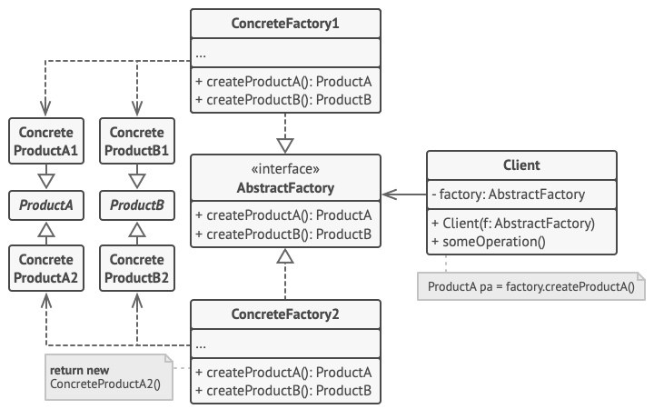
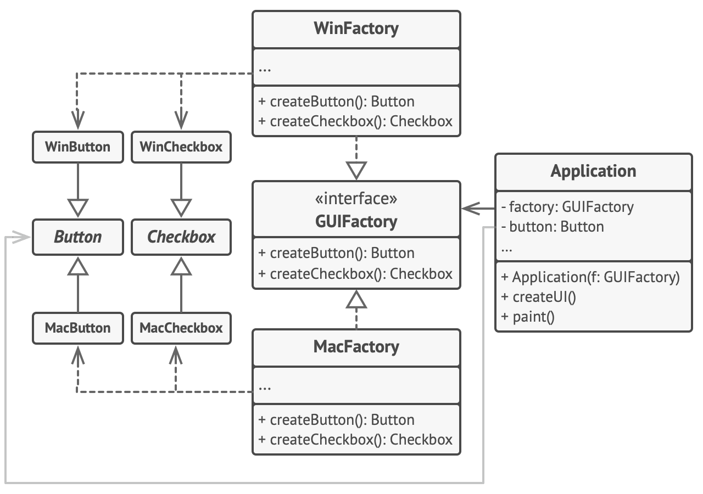
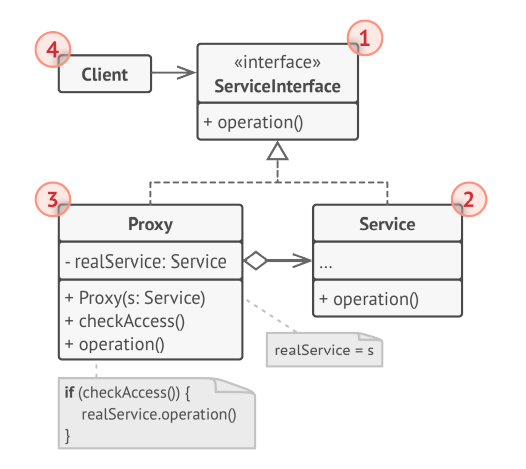

# Clean Code
## SOLID
SOLID là một tập hợp các nguyên tắc thiết kế phần mềm trong lập trình hướng đối tượng được đưa ra bởi Robert C. Martin, giúp các nhà phát triển tạo ra phần mềm dễ bảo trì và mở rộng. Mặc dù Go không phải là ngôn ngữ hoàn toàn hướng đối tượng, nhưng nguyên tắc này vẫn có thể áp dụng hiệu quả trong việc thiết kế code với Go.
### Single Responsibility Principle
> A module should have only one reason to change.

- Nội dung của nguyên lý này chỉ ra rằng mỗi package, struct và function đều nên chỉ giữ một trách nhiệm duy nhất. Nói cách khác, package, struct, function chỉ nên có một lý do duy nhất để thay đổi.

#### Struct
- Một struct có quá nhiều chức năng cũng sẽ trở nên cồng kềnh và phức tạp, việc này dẫn đến việc thay đổi code sẽ rất khó khăn, mất nhiều thời gian, còn dễ gây ảnh hưởng tới các module đang hoạt động khác.
- Ví dụ về struct vi phạm nguyên tắc SRP.
    ```go
    // Define user model
    type User struct {
	    ID        uint
	    FirstName string
	    LastName  string
	    Email     string
	    Password  string
    }

    func (u *User) SaveToDatabase() {
	    // Save user info in database
        // ...
    }

    func (*User) Authenticate(email, password string) {
	    // Authenticate user logic
        // ...
    }
    ```
    - Ở ví dụ trên, struct `User` vừa chịu trách nhiệm định nghĩa thực thể người dùng, vừa chịu trách nhiệm tương tác với database để lưu thông tin người dùng, vừa thực hiện các logic về việc xác thực người dùng. Điều này đã vi phạm nghiêm trọng nguyên tắc SRP khi struct `User` chịu một lúc 3 trách nhiệm.
    - Để đảm bảo SRP, ta có thể tách struct trên thành 3 phần riêng biệt.
    - Struct `User` trong `package model` để định nghĩa cấu trúc của thực thể người dùng
    ```go
    package model

    type User struct {
	    ID        uint
	    FirstName string
	    LastName  string
	    Email     string
	    Password  string
    }
    ```
    - Struct `UserRepository` trong `package repository` để thực hiện tương tác với database
    ```go
    package repository

    type UserRepository struct {
	    db     *gorm.DB
	    logger *zap.Logger
    }

    func (u *userRepository) CreateUser(ctx context.Context, user model.User) error {
        // Create new user to database
    }

    func (u *userRepository) UpdateUser(ctx context.Context, user model.User) error {
        // Update user in database
    }
    ```
    - Struct `UserService` trong `package service` để thực hiện các business logic
    ```go
    package service

    type userService struct {
	    userRepo repository.UserRepository
	    jwt      util.JwtUtil
	    logger   *zap.Logger
    }

    func (u *userService) Authenticate(ctx context.Context, email, password string) (accessToken string,err error) {
        // Authentication logic
    }
    ```

#### Function
- Các function trong Go cũng nên tuân thủ nguyên tắc SRP bằng cách chỉ nên tập trung xử lý một tác vụ duy nhất. Một function xử lí quá nhiều vấn đề có thể trở nên khó hiểu, khó bảo trì và kiểm thử. Bằng cách chia các hàm phức tạp thành các hàm nhỏ hơn và tập trung xử lý một vấn đề duy nhất, ta có thể làm cho code trở nên dễ hiểu, dễ bảo trì và kiểm thử.

### Open/Closed Principle
> Software entities (classes, modules, functions, etc...) should be open for extension, but closed for modification.

- Nội dung của nguyên lý chỉ ra rằng các thực thể trong phần mềm (module, struct, function,...) có thể dễ dàng mở rộng, thêm các hành vi mới, nhưng hạn chế hoặc cấm việc sửa đổi.
- Open for extension
    - Các đoạn code nên được thiết kế theo cách cho phép các hành vi của chúng có thể được dễ dàng mở rộng với các chức năng mới khi yêu cầu.
    - Trong Go, điều này có thể đạt được thông qua việc sử dụng `interface` và `composition`. Bằng cách thiết kế các thực thể giao tiếp với nhau thông qua `interface`, khi cần thay đổi và mở rộng, ta có thể tạo kiểu mới triển khai `interface` này mà không cần thay đổi code sẵn có.
- Closed for modification
    - Khi một module, struct và hàm trong Go đã được viết và kiểm thử, nó không nên bị sửa đổi mỗi khi thêm các chức năng mới. Điều này giảm thiểu nguy cơ gây ra lỗi trong các đoạn code đã được kiểm thử và đang hoạt động tốt.
- Áp dụng nguyên lý này giúp ta cải thiện khả năng bảo trì và mở rộng của mã nguồn đồng thời giảm thiểu rủi ro gây ra lỗi trong phần mềm đang hoạt động.
- Xét ví dụ sau đây về xử lý thanh toán
    ```go
    type Payment struct {
	    Type    string
	    Account string
	    Amount  float64
    }

    func ProcessPayment(payment Payment) {
	    switch payment.Type {
	    case "CreditCard":
		    // Process credit card payment
		    fmt.Printf("Processing credit card payment of $%f from %s\n", payment.Amount, payment.Account)
		    // Perform credit card payment specific logic
	    case "BankTransfer":
		    // Process bank transfer payment
		    fmt.Printf("Processing bank transfer payment of $%f from %s\n", payment.Amount, payment.Account)
		    // Perform bank transfer specific logic
	    default:
		    fmt.Println("Invalid payment type")
	    }
    }
    ```
- Trong đoạn code trên, hàm `ProcessPayment()` sẽ xử lý thanh toán của người dựa trên nhiều cách khác nhau. Đoạn code này sẽ vi phạm nguyên tắc OCP vì khi ta cần thêm các phương thức thanh toán khác như thanh toán qua ví Momo, VNPay, ViettelMoney,.. hàm này sẽ phải thay đổi để xử lý các cách thanh toán mới. Thay vào đó, ta có thể sử dụng `interface` để áp dụng nguyên lý OCP.
    ```go
    type Payment interface {
	    Process()
    }

    type CreditCardPayment struct {
	    Account string
	    Amount  float64
    }

    func (ccp CreditCardPayment) Process() {
	    fmt.Printf("Processing credit card payment of $%f from %s\n", ccp.Amount, ccp.Account)
	    // Perform credit card payment specific logic
    }

    type BankTransferPayment struct {
	    Account string
	    Amount  float64
    }

    func (btp BankTransferPayment) Process() {
	    fmt.Printf("Processing bank transfer payment of $%f from %s\n", btp.Amount, btp.Account)
	    // Perform bank transfer specific logic
    }

    func ProcessPayment(payment Payment) {
	    payment.Process()
    }
    ```
    Với đoạn code trên, khi cần thêm phương thức thanh toán mới, ta có thể dễ dàng tạo một kiểu mới triển khai interface `Payment` mà không cần thay đổi code cũ.
- Ta cũng có thể sử dụng composition để mở rộng hành vi bằng các nhúng struct này vào struct khác
    ```go
    type BaseLogger struct {}

    func (l *BaseLogger) Log(message string) {
	    fmt.Println(message)
    }

    // Extend using composition
    type TimestampLogger struct {
	    BaseLogger
    }

    func (l *TimestampLogger) Log(message string) {
	    l.BaseLogger.Log(fmt.Sprintf("[%s] %s ", time.Now().Format("2006-01-02 15:04:05"), message))
    }
    ```

### Liskov Substitution Principle
>Objects in a program should be replaceable with instances of their subtypes without altering the correctness of that program.

- Nội dung của nguyên lý này chỉ ra rằng đối tượng của lớp cha có thể thay thế bằng các lớp con của nó mà không làm thay đổi tính đúng đắn của chương trình.
- Trong Go, nguyên lý này được thể hiện thông qua `interface`.
- Nếu một kiểu `T` implement interface `I` thì các đối tượng của kiểu `T` có thể thay thế cho kiểu `I` mà không làm thay đổi tính chất, hành vi mong đợi của chương trình (tính đúng đắn, nhiệm vụ cần thực hiện,...). Nghĩa là bất kỳ một kiểu (type) nào implement interface `I` thì hành vi của các phương thức của nó phải nhất quán với kỳ vọng được đặt ra bởi interface đó.

    ```go
    type Notifier interface {
	    Send(message string) error
    }

    // EmailNotifier sends notifications via email.
    type EmailNotifier struct{}

    func (e EmailNotifier) Send(message string) error {
	    fmt.Println("Sending email:", message)
	    return nil
    }

    // SMSNotifier sends notifications via SMS.
    type SMSNotifier struct{}

    func (s SMSNotifier) Send(message string) error {
	    fmt.Println("Sending SMS:", message)
	    return nil
    }

    // SendNotification accepts a Notifier and sends a notification.
    func SendNotification(notifier Notifier, message string) {
	    err := notifier.Send(message)
	    if err != nil {
		    fmt.Println("Error sending notification:", err)
	    }
    }

    ```

### Interface Segregation Principle

> A client should not be forced to depend on methods it does not use.

- Nội dung của nguyên lý chỉ ra rằng thay vì dùng 1 `interface` lớn, ta nên tách thành nhiều `interface` nhỏ, với nhiều mục đích cụ thể.
- Khi một kiểu (type) triển khai một `interface` thì nó sẽ phải implement tất cả các `method` trong `interface` đó. Nếu chúng ta tạo ra một `interface` lớn với rất nhiều `method`, mỗi `type` sẽ phải implement toàn bộ tất cả các `method` đó, kể cả những `method` không bao giờ sử dụng đến. Nếu ta áp dụng ISP, chia interface này ra thành nhiều interface nhỏ, với các mục đích cụ thể thì các `type` chỉ cần implement những `interface` có chức năng mà chúng cần, không cần phải implement những chức năng thừa nữa.

- Ví dụ ta thiết kế `interface Animal` như sau
    ```go
    type Animal interface {
	    Eat()
	    Drink()
	    Sleep()
    }

    type Cat struct {}

    func (cat Cat) Eat() {}
    func (cat Cat) Drink() {}
    func (cat Cat) Sleep() {}

    type Dog struct {}

    func (dog Dog) Eat() {}
    func (dog Dog) Drink() {}
    func (dog Dog) Sleep() {}

    ```
    Khi ta muốn thêm muốn thêm 1 số loài động vật mới và tính năng vào, ta phải thêm có thêm method vào trong interface như: bơi lội, bay, săn mồi, … Điều này làm interface phình to ra. Khi một loài động vật kế thừa interface, nó phải implement luôn cả những hàm không dùng đến.
    ```go
    type Animal interface {
	    Eat()
	    Drink()
	    Sleep()
	    Fly()
	    Swim()
    }

    type Fish struct{}

    func (Fish) Eat() {}

    // ...
    func (Fish) Fly() {
	    log.Println("Fish does not fly")
    }

    type Bird struct{}

    func (Bird) Eat() {}
    // ...
    func (Bird) Swim() {
	    log.Println("Bird does not swim")
    }
    ```
    Thay vào đó, ta có thể chia `interface Animal` thành các `interface` nhỏ hơn
    ```go
    type Animal interface {
	    Eat()
	    Drink()
	    Sleep()
    }

    type Fish interface {
	    Swim()
    }

    type Bird interface {
	    Fly()
    }
    ```

### Dependency Inversion Principle

> - High-level modules should not depend on low-level modules. Both should depend on abstractions.    
> - Abstractions should not depend upon details. Details should depend upon abstractions.

- Nội dung của nguyên lý gồm 2 phần
    - Các `module` cấp cao không nên phụ thuộc vào các `module` cấp thấp. Cả 2 nên phụ thuộc vào abstraction.
    - `Interface` (abstraction) không nên phụ thuộc vào chi tiết, mà ngược lại. (Các `struct` giao tiếp với nhau thông qua `interface`, không phải thông qua implementation.)
- Thông thường các `module` cấp cao sẽ gọi các `module` cấp thấp. `Module` cấp cao sẽ phụ thuộc vào `module` cấp thấp, điều đó tạo ra các dependency. Khi module cấp thấp thay đổi, `module` cấp cao phải thay đổi theo. Một thay đổi sẽ kéo theo hàng loạt thay đổi, giảm khả năng bảo trì của code.
- Nếu tuân theo DIP, các `module` cấp thấp lẫn cấp cao đều phụ thuộc vào 1 `interface` không đổi. Khi đó, ta có thể dễ dàng thay thế, sửa đổi module cấp thấp mà không ảnh hưởng gì tới module cấp cao, từ đó làm giảm sự phụ thuộc giữa các `module` với nhau.
- Việc các `struct` giao tiếp với nhau thông qua `interface` cũng làm cho việc kiểm thử trở nên dễ dàng hơn.
- Ví dụ
    ```go
    package repository

    type UserRepository interface {
	    CreateUser(ctx context.Context, user model.User) error
    }

    type userRepository struct {
	    db     *gorm.DB
	    logger *zap.Logger
    }

    func (u *userRepository) CreateUser(ctx context.Context, user model.User) error {
	    result := u.db.WithContext(ctx).Create(&user)
	    if result.Error != nil {
		    var err *pgconn.PgError
		    if errors.As(result.Error, &err) && err.Code == "23505" {
			    c := strings.Join(strings.Split(err.ConstraintName, "_")[2:], " ")
			    return NewUniqueConstraintError(c)
		    }
	    }
	    return result.Error
    }

    func NewUserRepository(db *gorm.DB, logger *zap.Logger) (UserRepository, error) {
	    if db == nil {
		    return nil, errors.New("db must not be nil")
	    }
	    if logger == nil {
		    return nil, errors.New("logger must not be nil")
	    }
	    return &userRepository{
		    db:     db,
		    logger: logger,
	    }, nil
    }
    ```

    ```go
    package service

    type UserService interface {
	    Register(ctx context.Context, user model.User) error
    }

    type userService struct {
	    userRepo repository.UserRepository
	    jwt      util.JwtUtil
	    logger   *zap.Logger
    }

    func (u *userService) Register(ctx context.Context, user model.User) error {
	    hash, err := bcrypt.GenerateFromPassword([]byte(user.Password), bcrypt.DefaultCost)
	    if err != nil {
		    u.logger.Error("failed to generate password", zap.Error(err))
		    return err
	    }
	    user.Password = string(hash)
	    err = u.userRepo.CreateUser(ctx, user)
	    return err
    }


    
    func NewUserService(userRepo repository.UserRepository, jwt util.JwtUtil, logger *zap.Logger) (UserService, error) {
	    if userRepo == nil {
		    return nil, errors.New("userRepo must not be nil")
	    }
	    if jwt == nil {
		    return nil, errors.New("jwt must not be nil")
    	}
	    if logger == nil {
		    return nil, errors.New("logger must not be nil")
	    }
	    return &userService{
		    userRepo: userRepo,
		    jwt:      jwt,
		    logger:   logger,
	    }
    }
    ```

    Ở ví dụ trên `userService` không phụ thuộc trực tiếp vào triển khai cụ thể của `userRepository`, mà chỉ phụ thuộc vào `interface`. Điều này khiến cho mọi sự thay đổi liên quan đến `userRepository` không làm ảnh hưởng đến `userService`, đồng thời, ta có thể dễ dàng thay đổi các implementations của `UserRepository` thông qua việc truyền implementation mới vào hàm khởi tạo `userService`.


#### Dependency Injection
- Dependency Injection là kỹ thuật thiết kế phần mềm trong đó một đối tượng nhận các dependency của nó từ bên ngoài thay vì tự tạo hay quản lý chúng.
- Kỹ thuật này giúp triển khai nguyên lý Dependency Inversion, làm giảm sự phụ thuộc giữa các đối tượng thông qua việc giao tiếp qua `interface` thay vì các triển khai cụ thể.
- Các `struct` thay vì tự tạo và quản lý các dependencies của mình thì các dependencies này sẽ được truyền vào từ bên ngoài thông qua `constructor` hoặc `method`.
- Các cách để truyền denpendencies
    - `Constructor Injection`: 
        - Dependency được truyền vào thông qua constructor của `struct`.
        - Cách này được sử dụng khi `struct` cần có các dependency bắt buộc để hoạt động bình thường. 
        - Cách này đảm bảo các đối tượng luôn ở trạng thái hợp lệ sau khi được khởi tạo và thể hiện rõ các dependencies cần thiết để `struct` hoạt động bình thường.
        - Ta cần kiểm tra `nil` khi nhận dependencies để đảm bảo an toàn.
        ```go
        type userService struct {
	        userRepo repository.UserRepository
	        jwt      util.JwtUtil
	        logger   *zap.Logger
        }

        func NewUserService(userRepo repository.UserRepository, jwt util.JwtUtil, logger *zap.Logger) (UserService, error) {
	        if userRepo == nil {
		        return nil, errors.New("userRepo must not be nil")
	        }
	        if jwt == nil {
		        return nil, errors.New("jwt must not be nil")
    	    }
	        if logger == nil {
		        return nil, errors.New("logger must not be nil")
	        }
	        return &userService{
		        userRepo: userRepo,
		        jwt:      jwt,
		        logger:   logger,
	        }
        }
        ```
    - `Property Injection (Setter Injection)`
        - Dependency được truyền vào thông qua các hàm `setter`.
        - Cách này được sử dụng chỉ khi dependency thực sự là tùy chọn (optional hoặc `struct` cần đến nó đã có sẵn default implementation của dependency này) hoặc khi ta cần thay đổi implementation của dependency trong vòng đời của đối tượng.
        - Nhược điểm của cách này là không đảm bảo dependency sẽ tồn tại khi đoạn code cần đến chúng được thực thi.
            ```go
            func (u *userService) SetUserRepository(userRepo repository.UserRepository) {
	            u.userRepo = userRepo
            }
            ```

    - `Method Injection`
        - Dependency sẽ được truyền thẳng vào các method cần đến nó dưới dạng tham số, cho phép chúng chỉ được sử dụng khi method đó được thực thi (chỉ tồn tại trong 1 lần gọi của method đó).
        - Cách này được sử dụng khi các lần gọi method khác nhau cần các cách triển khai khác nhau của dependency hoặc cần truyền các dependency tạm thời chỉ cần thiết trong method đó.
            ```go
            func (u *userService) Register(ctx context.Context, user model.User, userRepo repository.UserRepository) error {
	            // Process register business logic 
            }
            ```
- Sử dụng dependency injection làm cho code tăng khả năng kiểm thử bằng cách dễ dàng thay thế các dependency thật bằng các mock hoặc stub trong testing.
- Dependency Injection còn giúp code tăng khả năng mở rộng bằng cách dễ dàng thay đổi hoặc thêm mới behavior bằng cách thay đổi implementation được truyền vào.
- Dễ dàng hơn khi viết code khi tách biệt trách nhiệm khởi tạo và sử dụng đối tượng. Các dependencies sẽ được khởi tạo và quản lý ở một file riêng biệt và được truyền vào các `struct` khi cần sử dụng đến.

## Design Pattern
- Design Pattern là những giải pháp điển hình cho các vấn đề thường gặp trong thiết kế phần mềm. Chúng giống như những bản thiết kế có sẵn mà ta có thể tùy chỉnh để giải quyết một vấn đề thiết kế lặp đi lặp lại trong phần mềm.
- Design Pattern không phải là một code cụ thể, mà là một khái niệm chung để giải quyết một vấn đề cụ thể. Ta có thể tuân theo chi tiết của design pattern và triển khai một giải pháp phù hợp với từng bài toán và vấn đề cụ thể.

### Creational Pattern
- Creational Design Patterns (Mẫu thiết kế tạo lập) là một nhóm các mẫu thiết kế trong lập trình hướng đối tượng, tập trung vào cách khởi tạo đối tượng. Các mẫu này giúp tạo đối tượng theo cách phù hợp với từng tình huống cụ thể.

1. **Singleton**
- Singleton là một mẫu thiết kế đảm bảo rằng một `struct` chỉ có một thực thể (instance) duy nhất và cung cấp một điểm truy cập toàn cục đến thực thể đó.
- Thông thường, một singleton instance được tạo ra khi `struct` được khởi tạo lần đầu tiên. Để làm được điều này, ta định nghĩa một method `getInstance` chịu trách nhiệm cho việc tạo và trả về một instance duy nhất của `struct` này. Hàm này cũng phải trả về đúng một instance duy nhất trong trường hợp nhiều goroutine truy cập cùng lúc.
- Dưới đây là ví dụ về cách implement pattern này
    ```go
    // Define a mutex to ensure thread safety during singleton creation
    var lock = sync.Mutex{}

    // Define the singleton struct
    type single struct {
    }

    // Define a package-level variable to hold the singleton instance
    var singleInstance *single

    func getInstance() *single {
	    // First check if instance already exists
	    if singleInstance == nil {
		    // Lock to prevent multiple goroutines from creating instances simultaneously
		    lock.Lock()
		    defer lock.Unlock()

		    // Double-check if instance is still nil after acquiring the lock
		    // (another goroutine might have created it while we were waiting for the lock)
		    if singleInstance == nil {
			    fmt.Println("Creating single instance now.")
			    singleInstance = &single{}
		    } else {
			    fmt.Println("Single instance already created.")
		    }
	    } else {
		    fmt.Println("Single instance already created.")
	    }
	    return singleInstance
    }

    func main() {
	    wg := sync.WaitGroup{}
	    for i := 0; i < 5; i++ {
		    wg.Add(1)
		    go func() {
			    getInstance()
			    wg.Done()
		    }()
	    }
	    wg.Wait()
    }
    ```
    ```
    Creating single instance now.
    Single instance already created.
    Single instance already created.
    Single instance already created.
    Single instance already created.
    ```

2. **Abstract Factory**
- Abstract Factory là một mẫu thiết kế giúp ta tạo ra một tập các đối tượng có liên quan, làm việc và tương thích với nhau mà không cần biết `struct` cụ thể của chúng.
- Abstract Factory sẽ định nghĩa `interface` chứa các phương thức để tạo ra các đối tượng riêng biệt. Mỗi triển khai của `interface` này sẽ tạo ra các đối tượng theo cách riêng của mình, tạo ra các biến thể khác nhau của tập các đối tượng.
- Client code sẽ làm việc với tập các `interface` của từng đối tượng, không làm việc với các triển khai cụ thể, việc này làm ta có thể dễ dàng thay đổi các tập đối tượng bằng các truyền vào một struct factory mới mà không phải thay đổi client code.
- Cấu trúc của Abstract Factory

    
- Ta xét ví dụ sau đây

    
    - Ví dụ trên áp dụng Abstract Factory để tạo ra các tập thành phần UI gồm button và checkbox cho các hệ điều hành khác nhau.
    - `GUIFactory` là một `interface` định nghĩa các phương thức để tạo button và checkbox. `WinFactory` và `MacFactory` là hai triển khai của `interface` và tạo ra các button và checkbox khác nhau tương ứng với các hệ điều hành khác nhau.
    - Application sẽ sử dụng interface `GUIFactory` để tạo các thành phần UI và làm việc với chúng sử dụng interface `Checkbox` và `Button` mà không phụ thuộc vào cài đặt cụ thể. Việc này làm ta có thể dễ dàng chuyển đổi các tập thành phần UI giữa các hệ điều hành khác nhau.

### Structural Pattern
- Structural Pattern là một loạt các design pattern tập trung vào cách kết hợp các đối tượng và struct thành những cấu trúc lớn hơn, đồng thời vẫn giữ cho các cấu trúc này linh hoạt và hiệu quả.

1. **Proxy**
- Proxy là một mẫu thiết kế cho phép cung cấp một đối tượng thay thế hoặc đại diện cho đối tượng gốc. Đối tượng này sẽ kiểm soát quyền truy cập vào đối tượng gốc, cho phép ta thực hiện một số thao tác trước hoặc sau khi yêu cầu được chuyển đến đối tượng gốc.
- Ta sẽ tạo một struct mới (proxy) đại diện cho struct gốc cung cấp các phương thức giống như struct gốc (implement cùng interface với struct gốc). Khi một đoạn code cần dùng đến struct gốc, ta truyền struct proxy vào thay vì struct gốc. Khi đó, struct proxy này sẽ nhận các yêu cầu, nó sẽ thực hiện một số thao tác xử lý trước khi chuyển tiếp yêu cầu đến struct gốc.
- Pattern này giúp chúng ta thêm một số chức năng, thao tác xử lý mà không phải thay đổi các đoạn code, struct có sẵn.
- Cấu trúc

    

- Proxy Pattern có nhiều ứng dụng như lazy initialization (virtual proxy),access control (protection proxy), logging requests (logging proxy), caching request results (caching proxy),...

2. 
